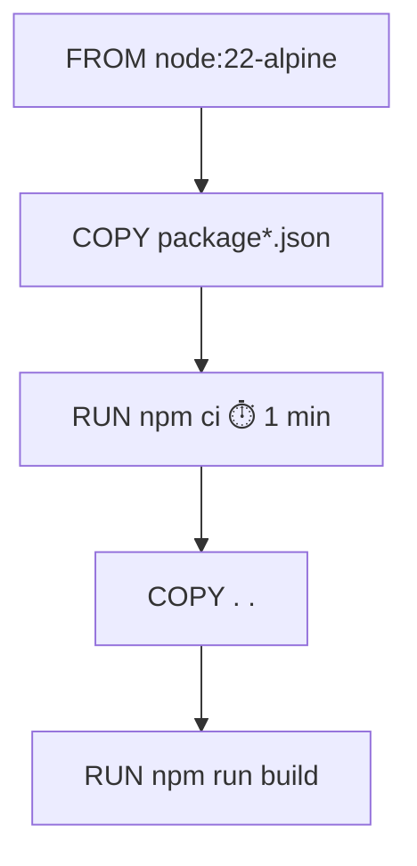

# Dockerfile

> [!abstract] En bref
> Le **Dockerfile** est la **recette** qui construit l'image de ton application, étape par étape : partir d'une base (Node), copier les fichiers, installer les dépendances, construire, définir la commande de démarrage. Chaque ligne crée une **couche**, mise en cache pour accélérer les constructions suivantes.

## Le Dockerfile de CinéTrack-API (version simple)

```dockerfile
# 1. la base : Node 22 sur une Linux légère
FROM node:22-alpine

# 2. le dossier de travail dans l'image
WORKDIR /app

# 3. d'abord les fichiers de dépendances (pour profiter du cache)
COPY package*.json ./
RUN npm ci

# 4. puis le code
COPY . .
RUN npx prisma generate && npm run build

# 5. informations et démarrage
ENV NODE_ENV=production
EXPOSE 3000
CMD ["node", "dist/main.js"]
```

```bash
docker build -t cinetrack-api .
docker run -p 3000:3000 --env-file .env cinetrack-api
```

## Les instructions

| Instruction | Rôle |
|---|---|
| `FROM` | l'image de départ |
| `WORKDIR` | le dossier courant dans l'image |
| `COPY` | copier des fichiers de ta machine vers l'image |
| `RUN` | exécuter une commande **pendant la construction** |
| `ENV` | une variable d'environnement |
| `EXPOSE` | documente le port utilisé (n'ouvre rien tout seul) |
| `USER` | l'utilisateur qui lance l'application |
| `CMD` | la commande lancée **au démarrage du conteneur** |

## Le cache : l'ordre des lignes compte

Docker réutilise une étape si **rien n'a changé** avant elle.



En copiant `package.json` **avant** le code, une modification de ton code ne relance **pas** `npm ci` : la construction passe de plusieurs minutes à quelques secondes.

## Le fichier `.dockerignore`

Ce qui ne doit **pas** entrer dans l'image :

```text
node_modules
dist
.git
.env
*.md
coverage
```

Sans lui, tu copies `node_modules` (énorme) et **`.env` avec tes secrets** dans l'image.

## Les bonnes pratiques

- **Une image de base légère et versionnée** : `node:22-alpine`, pas `node:latest`.
- **`npm ci`** plutôt que `npm install`.
- **Ne pas lancer en root** : `USER node` (l'utilisateur prévu par l'image Node).
- **Aucun secret dans l'image** : ils arrivent au lancement (`--env-file`, variables de l'hébergeur).
- **Une image finale minimale** avec le build en plusieurs étapes : [[DK-08-Multi-stage-Builds|Multi-stage builds]].

## Pièges

- **`COPY . .` avant `npm ci`** : le cache ne sert jamais, chaque construction réinstalle tout.
- **Un secret dans un `ENV` ou un `COPY .env`** : il est lisible par quiconque récupère l'image.
- **Confondre `RUN` et `CMD`** : `RUN` pendant la construction, `CMD` au démarrage.
