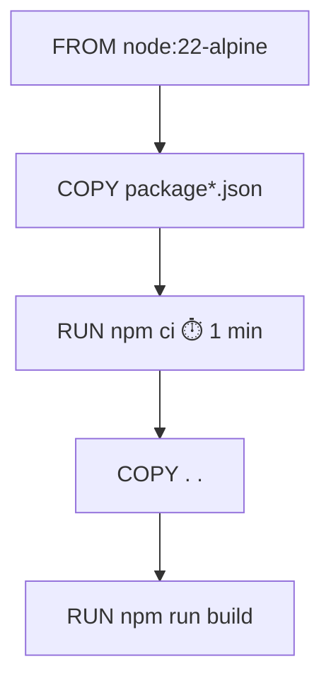

# Dockerfile

> [!abstract] En bref
> Le **Dockerfile** est la **recette** qui construit l'image de ton application, étape par étape : partir d'une base (Node), copier les fichiers, installer les dépendances, construire, définir la commande de démarrage. Chaque ligne crée une **couche**, mise en cache pour accélérer les constructions suivantes.

## Le Dockerfile de CinéTrack-API (version simple)

```dockerfile
# 1. la base : Node 22 sur une Linux légère
FROM node:22-alpine

# 2. le dossier de travail dans l'image
WORKDIR /app

# 3. d'abord les fichiers de dépendances (pour profiter du cache)
COPY package*.json ./
RUN npm ci

# 4. puis le code
COPY . .
RUN npx prisma generate && npm run build

# 5. informations et démarrage
ENV NODE_ENV=production
EXPOSE 3000
CMD ["node", "dist/main.js"]
```

```bash
docker build -t cinetrack-api .
docker run -p 3000:3000 --env-file .env cinetrack-api
```

## Les instructions

| Instruction | Rôle |
|---|---|
| `FROM` | l'image de départ |
| `WORKDIR` | le dossier courant dans l'image |
| `COPY` | copier des fichiers de ta machine vers l'image |
| `RUN` | exécuter une commande **pendant la construction** |
| `ENV` | une variable d'environnement |
| `EXPOSE` | documente le port utilisé (n'ouvre rien tout seul) |
| `USER` | l'utilisateur qui lance l'application |
| `CMD` | la commande lancée **au démarrage du conteneur** |

## Le cache : l'ordre des lignes compte

Docker réutilise une étape si **rien n'a changé** avant elle.


```mermaid
flowchart TB
  A["FROM node:22-alpine"] --> B["COPY package*.json"]
  B --> C["RUN npm ci  ⏱️ 1 min"]
  C --> D["COPY . ."]
  D --> E["RUN npm run build"]
```

En copiant `package.json` **avant** le code, une modification de ton code ne relance **pas** `npm ci` : la construction passe de plusieurs minutes à quelques secondes.

## Le fichier `.dockerignore`

Ce qui ne doit **pas** entrer dans l'image :

```text
node_modules
dist
.git
.env
*.md
coverage
```

Sans lui, tu copies `node_modules` (énorme) et **`.env` avec tes secrets** dans l'image.

## Les bonnes pratiques

- **Une image de base légère et versionnée** : `node:22-alpine`, pas `node:latest`.
- **`npm ci`** plutôt que `npm install`.
- **Ne pas lancer en root** : `USER node` (l'utilisateur prévu par l'image Node).
- **Aucun secret dans l'image** : ils arrivent au lancement (`--env-file`, variables de l'hébergeur).
- **Une image finale minimale** avec le build en plusieurs étapes : [[DK-08-Multi-stage-Builds|Multi-stage builds]].

## Pourquoi ça marche

Chaque instruction du Dockerfile produit une **couche** : un instantané des fichiers après cette étape. Docker garde ces couches en cache. Pour réutiliser une couche, il vérifie que **l'instruction et tout ce qui la précède** n'ont pas changé.

C'est pour ça que l'ordre compte : `package.json` change rarement, le code change tout le temps. En copiant `package.json` d'abord, l'étape lente (`npm ci`) reste en cache tant que les dépendances ne changent pas.

`RUN` agit **pendant la construction** (le résultat est figé dans l'image), `CMD` agit **au démarrage** de chaque conteneur.

## Contre-exemple

**Intuition fausse : « `EXPOSE 3000` rend l'application accessible sur le port 3000 ».**

```dockerfile
EXPOSE 3000
```

```bash
docker run cinetrack-api   # http://localhost:3000 → rien ne répond
```

`EXPOSE` ne fait que **documenter** le port. Pour y accéder depuis ta machine, il faut **publier** le port au lancement : `docker run -p 3000:3000 cinetrack-api`.

## Pièges

- **`COPY . .` avant `npm ci`** : le cache ne sert jamais, chaque construction réinstalle tout.
- **Un secret dans un `ENV` ou un `COPY .env`** : il est lisible par quiconque récupère l'image.
- **Confondre `RUN` et `CMD`** : `RUN` pendant la construction, `CMD` au démarrage.

## Vérifie sans tes notes

Réponds de tête, à voix haute ou par écrit, **avant** d’ouvrir la réponse.

**1. Quelle différence entre `RUN` et `CMD` ?**

> [!check]- Réponse
> `RUN` s'exécute pendant la construction de l'image ; `CMD` est la commande lancée au démarrage du conteneur.

**2. Pourquoi copier `package*.json` avant le reste du code ?**

> [!check]- Réponse
> Pour que `npm ci` reste en cache tant que les dépendances ne changent pas : une modification du code ne relance pas l'installation.

**3. À quoi sert `.dockerignore` ?**

> [!check]- Réponse
> À empêcher certains fichiers d'entrer dans l'image : `node_modules`, `.git`, et surtout `.env` avec les secrets.

## Exercices

> [!info] Comment t’entraîner
> 1. Cherche seul, sans regarder la note.
> 2. Bloqué ? Ouvre l’**indice 1**, puis l’**indice 2**.
> 3. Seulement ensuite, la **solution**.
> 4. Referme tout et **refais l’exercice sans regarder**.

### Exercice 1 · Trouver les erreurs

Ce Dockerfile fonctionne, mais contient 4 mauvaises pratiques. Lesquelles ?

```dockerfile
FROM node:latest
WORKDIR /app
COPY . .
RUN npm install
ENV JWT_SECRET=super-secret
CMD ["node", "dist/main.js"]
```

> [!tip]- Indice 1
> Regarde : la version de l'image de base, l'ordre des `COPY`, la commande d'installation, et ce qu'on met dans `ENV`.

> [!tip]- Indice 2
> Quelle ligne casse le cache à chaque modification du code ? Quelle ligne exposerait un secret à quiconque récupère l'image ?

> [!success]- Solution
> 1. **`node:latest`** : version qui change avec le temps → `node:22-alpine`.
> 2. **`COPY . .` avant l'installation** : le cache ne sert jamais → `COPY package*.json ./`, installation, puis `COPY . .`.
> 3. **`npm install`** → `npm ci` (installe exactement le `package-lock.json`).
> 4. **Un secret dans `ENV`** : lisible dans l'image → le passer au lancement (`--env-file`).
>
> Bonus : ajouter `USER node` pour ne pas tourner en root.

### Exercice 2 · Écrire le Dockerfile d'un script

Écris le Dockerfile d'un petit script Node `index.js` qui n'a **aucune** dépendance npm. Il doit tourner avec Node 22 (version légère) et ne pas s'exécuter en root.

> [!tip]- Indice 1
> Il faut une image de base, un dossier de travail, copier le fichier, et une commande de démarrage.

> [!tip]- Indice 2
> Pas de `package.json` ici, donc pas de `npm ci`. L'image Node fournit l'utilisateur `node`.

> [!success]- Solution
> ```dockerfile
> FROM node:22-alpine
> WORKDIR /app
> COPY index.js ./
> USER node
> CMD ["node", "index.js"]
> ```

### Transfert · Le cache qui ne sert jamais

Un problème différent : il vérifie que tu as compris le principe, pas seulement l’exemple.

Chaque construction de ton image Angular prend 4 minutes, même quand tu changes une seule ligne de CSS. Voici le début du Dockerfile. Explique la cause, et réécris ces lignes.

```dockerfile
FROM node:22-alpine
WORKDIR /app
COPY . .
RUN npm ci
RUN npm run build
```

> [!tip]- Indice 1
> Que se passe-t-il pour toutes les couches suivantes quand une couche change ?

> [!tip]- Indice 2
> La moindre modification d'un fichier change la couche `COPY . .` : tout ce qui suit est refait, y compris `npm ci`.

> [!success]- Solution
> `COPY . .` copie **tout** : la moindre modification change cette couche, donc `npm ci` (la plus lente) est relancée à chaque fois.
>
> ```dockerfile
> FROM node:22-alpine
> WORKDIR /app
> COPY package*.json ./
> RUN npm ci
> COPY . .
> RUN npm run build
> ```
>
> Maintenant, changer du CSS ne relance que `COPY . .` et `npm run build`.

## Je maîtrise quand…

Coche quand tu sais le faire **sans aide**. Une notion n’est maîtrisée que si les 6 cases sont cochées (voir [[Methode-du-coach|Méthode du coach]]).

- [ ] **Expliquer** : Expliquer le principe des couches et du cache
- [ ] **Rappeler** : Dire de mémoire le rôle de `FROM`, `WORKDIR`, `COPY`, `RUN`, `CMD` et la différence `RUN` / `CMD`
- [ ] **Utiliser** : Écrire le Dockerfile d'une application Node sans modèle
- [ ] **Résoudre un problème nouveau** : Prévoir quelles étapes seront refaites après une modification
- [ ] **Repérer les erreurs** : Repérer dans un Dockerfile un secret, un `latest` ou un mauvais ordre de `COPY`
- [ ] **Savoir quand ne pas l’utiliser** : Savoir quand un simple Dockerfile ne suffit pas : image finale trop lourde → multi-stage
