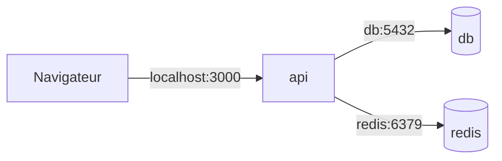

# Docker Compose

> [!abstract] En bref
> Ton application, ce n'est pas un seul conteneur : il y a l'API, PostgreSQL, Redis, le front. **Docker Compose** décrit **tous ces services dans un seul fichier** et les lance d'une seule commande : `docker compose up`. C'est l'outil du quotidien pour développer CinéTrack en local.

## Le `docker-compose.yml` de CinéTrack (développement)

```yaml
services:
  db:
    image: postgres:17
    environment:
      POSTGRES_USER: cinetrack
      POSTGRES_PASSWORD: motdepasse
      POSTGRES_DB: cinetrack
    ports:
      - "5432:5432"
    volumes:
      - db-data:/var/lib/postgresql/data     # les données survivent
    healthcheck:
      test: ["CMD-SHELL", "pg_isready -U cinetrack"]
      interval: 5s
      retries: 5

  redis:
    image: redis:7
    ports:
      - "6379:6379"

  api:
    build: ./apps/api
    env_file: ./apps/api/.env
    environment:
      DATABASE_URL: postgresql://cinetrack:motdepasse@db:5432/cinetrack   # « db » = nom du service
      REDIS_URL: redis://redis:6379
    ports:
      - "3000:3000"
    depends_on:
      db:
        condition: service_healthy            # attend que la base soit prête

volumes:
  db-data:
```



Les services se parlent par leur **nom** (`db`, `redis`) : Compose crée un réseau commun (voir [[DK-05-Reseaux|Réseaux]]).

## Les commandes

| Commande | Rôle |
|---|---|
| `docker compose up -d` | tout lancer en arrière-plan |
| `docker compose up -d db redis` | seulement certains services |
| `docker compose ps` | l'état des services |
| `docker compose logs -f api` | suivre les logs de l'API |
| `docker compose exec db psql -U cinetrack` | entrer dans un service |
| `docker compose build` | reconstruire les images |
| `docker compose down` | tout arrêter (les volumes restent) |
| `docker compose down -v` | tout arrêter **et effacer les données** ⚠️ |

## Un usage pratique au quotidien

Souvent, on lance **seulement la base et Redis** avec Compose, et l'API / le front directement sur sa machine (`npm run start:dev`) pour profiter du rechargement instantané :

```bash
docker compose up -d db redis
npm run start:dev
```

## Pièges

- **`localhost` dans la configuration de l'API** quand elle tourne dans Compose : utilise le nom du service (`db`).
- **`depends_on` sans `healthcheck`** : l'API démarre avant que PostgreSQL soit prêt, et plante.
- **`down -v` par réflexe** : toutes les données de développement disparaissent.
- **Des mots de passe réels dans le fichier commité** : utilise un `.env` (Compose le lit automatiquement).
