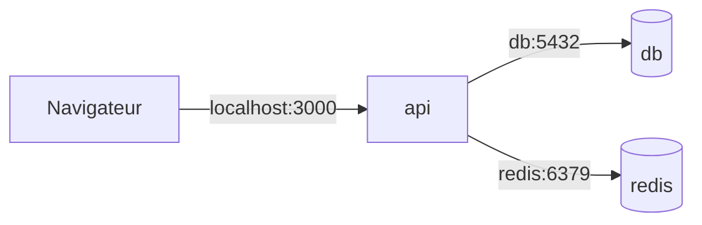

# Docker Compose

> [!abstract] En bref
> Ton application, ce n'est pas un seul conteneur : il y a l'API, PostgreSQL, Redis, le front. **Docker Compose** décrit **tous ces services dans un seul fichier** et les lance d'une seule commande : `docker compose up`. C'est l'outil du quotidien pour développer CinéTrack en local.

## Le `docker-compose.yml` de CinéTrack (développement)

```yaml
services:
  db:
    image: postgres:17
    environment:
      POSTGRES_USER: cinetrack
      POSTGRES_PASSWORD: motdepasse
      POSTGRES_DB: cinetrack
    ports:
      - "5432:5432"
    volumes:
      - db-data:/var/lib/postgresql/data     # les données survivent
    healthcheck:
      test: ["CMD-SHELL", "pg_isready -U cinetrack"]
      interval: 5s
      retries: 5

  redis:
    image: redis:7
    ports:
      - "6379:6379"

  api:
    build: ./apps/api
    env_file: ./apps/api/.env
    environment:
      DATABASE_URL: postgresql://cinetrack:motdepasse@db:5432/cinetrack   # « db » = nom du service
      REDIS_URL: redis://redis:6379
    ports:
      - "3000:3000"
    depends_on:
      db:
        condition: service_healthy            # attend que la base soit prête

volumes:
  db-data:
```


```mermaid
flowchart LR
  N["Navigateur"] -->|"localhost:3000"| API["api"]
  API -->|"db:5432"| DB[("db")]
  API -->|"redis:6379"| R[("redis")]
```

Les services se parlent par leur **nom** (`db`, `redis`) : Compose crée un réseau commun (voir [[DK-05-Reseaux|Réseaux]]).

## Les commandes

| Commande | Rôle |
|---|---|
| `docker compose up -d` | tout lancer en arrière-plan |
| `docker compose up -d db redis` | seulement certains services |
| `docker compose ps` | l'état des services |
| `docker compose logs -f api` | suivre les logs de l'API |
| `docker compose exec db psql -U cinetrack` | entrer dans un service |
| `docker compose build` | reconstruire les images |
| `docker compose down` | tout arrêter (les volumes restent) |
| `docker compose down -v` | tout arrêter **et effacer les données** ⚠️ |

## Un usage pratique au quotidien

Souvent, on lance **seulement la base et Redis** avec Compose, et l'API / le front directement sur sa machine (`npm run start:dev`) pour profiter du rechargement instantané :

```bash
docker compose up -d db redis
npm run start:dev
```

## Pourquoi ça marche

Avec `docker run`, il faudrait taper une longue commande par service, dans le bon ordre, avec les bons réseaux. Compose **décrit l'état voulu** dans un fichier (quels services, quelles images, quels ports, quels volumes) et s'occupe de tout créer.

Compose crée aussi un **réseau commun** à tous les services du fichier, avec un **nom DNS** par service : c'est pour ça que l'API trouve la base avec l'adresse `db`, et non `localhost`.

`depends_on` règle seulement l'**ordre de démarrage**. Avec `condition: service_healthy`, Compose attend en plus que le `healthcheck` de la base réponde : elle est vraiment prête à recevoir des connexions.

## Contre-exemple

**Intuition fausse : « `depends_on: [db]` garantit que la base est prête quand l'API démarre ».**

```yaml
api:
  depends_on: [db]
```

Le conteneur `db` est **démarré**, mais PostgreSQL met encore quelques secondes à s'initialiser : l'API tente de se connecter trop tôt et plante. Il faut un `healthcheck` sur `db` et `condition: service_healthy`.

## Pièges

- **`localhost` dans la configuration de l'API** quand elle tourne dans Compose : utilise le nom du service (`db`).
- **`depends_on` sans `healthcheck`** : l'API démarre avant que PostgreSQL soit prêt, et plante.
- **`down -v` par réflexe** : toutes les données de développement disparaissent.
- **Des mots de passe réels dans le fichier commité** : utilise un `.env` (Compose le lit automatiquement).

## Vérifie sans tes notes

Réponds de tête, à voix haute ou par écrit, **avant** d’ouvrir la réponse.

**1. Pourquoi l'API utilise-t-elle `db:5432` et pas `localhost:5432` dans Compose ?**

> [!check]- Réponse
> Dans un conteneur, `localhost` désigne le conteneur lui-même ; Compose donne à chaque service un nom (`db`) joignable sur le réseau commun.

**2. Quelle différence entre `docker compose down` et `docker compose down -v` ?**

> [!check]- Réponse
> `down` arrête et supprime les conteneurs, les volumes restent ; `-v` supprime aussi les volumes, donc les données.

**3. À quoi sert `condition: service_healthy` ?**

> [!check]- Réponse
> À attendre que le service soit réellement prêt (son healthcheck répond), pas seulement démarré.

## Exercices

> [!info] Comment t’entraîner
> 1. Cherche seul, sans regarder la note.
> 2. Bloqué ? Ouvre l’**indice 1**, puis l’**indice 2**.
> 3. Seulement ensuite, la **solution**.
> 4. Referme tout et **refais l’exercice sans regarder**.

### Exercice 1 · Ajouter un service

Ajoute au `docker-compose.yml` un service `adminer` (image `adminer`), une interface web pour voir la base, accessible sur `http://localhost:8081`. L'application écoute sur le port 8080 dans le conteneur, et le service doit démarrer après `db`.

> [!tip]- Indice 1
> Un service = une clé sous `services`, avec `image`, `ports` et `depends_on`.

> [!tip]- Indice 2
> Le port s'écrit `"machine:conteneur"`, donc `"8081:8080"`.

> [!success]- Solution
> ```yaml
> services:
>   adminer:
>     image: adminer
>     ports:
>       - "8081:8080"
>     depends_on:
>       - db
> ```
>
> Dans Adminer, le serveur à indiquer est `db` (le nom du service), pas `localhost`.

### Exercice 2 · Choisir la commande

Quelle commande Compose pour chaque situation ?
1. Lancer seulement la base et Redis.
2. Voir pourquoi l'API a planté.
3. Ouvrir `psql` dans la base.
4. Tout arrêter **sans** perdre les données.
5. Repartir d'une base complètement vide.

> [!tip]- Indice 1
> Les commandes de la note : `up`, `logs`, `exec`, `down`, avec certaines options.

> [!tip]- Indice 2
> Pour ne garder que certains services, on met leurs noms à la fin de `up -d`. Pour effacer les données, une option de `down`.

> [!success]- Solution
> 1. `docker compose up -d db redis`
> 2. `docker compose logs -f api`
> 3. `docker compose exec db psql -U cinetrack`
> 4. `docker compose down`
> 5. `docker compose down -v` puis `docker compose up -d` ⚠️ toutes les données sont perdues

### Transfert · L'API qui ne trouve pas Redis

Un problème différent : il vérifie que tu as compris le principe, pas seulement l’exemple.

Ton API tourne dans Compose. Elle plante avec `ECONNREFUSED 127.0.0.1:6379`. Son fichier `.env` contient `REDIS_URL=redis://localhost:6379`. Le service Redis s'appelle `cache` dans le `docker-compose.yml`. Explique la cause et corrige.

> [!tip]- Indice 1
> `127.0.0.1` = `localhost`. Dans un conteneur, qui est `localhost` ?

> [!tip]- Indice 2
> Dans Compose, on joint un autre service par son nom.

> [!success]- Solution
> Dans le conteneur de l'API, `localhost` désigne **l'API elle-même**, où Redis ne tourne pas.
>
> ```bash
> REDIS_URL=redis://cache:6379
> ```
>
> Le nom du service (`cache`) sert d'adresse sur le réseau de Compose.

## Je maîtrise quand…

Coche quand tu sais le faire **sans aide**. Une notion n’est maîtrisée que si les 6 cases sont cochées (voir [[Methode-du-coach|Méthode du coach]]).

- [ ] **Expliquer** : Expliquer ce que Compose apporte par rapport à plusieurs `docker run`
- [ ] **Rappeler** : Dire de mémoire les commandes `up`, `logs`, `exec`, `down` et le danger de `down -v`
- [ ] **Utiliser** : Écrire un `docker-compose.yml` avec une base, un volume et un healthcheck sans modèle
- [ ] **Résoudre un problème nouveau** : Prévoir l'adresse à utiliser entre deux services
- [ ] **Repérer les erreurs** : Diagnostiquer un `ECONNREFUSED` ou un service qui démarre trop tôt
- [ ] **Savoir quand ne pas l’utiliser** : Savoir quand Compose ne suffit plus : plusieurs serveurs en production → orchestrateur (Kubernetes) ou hébergeur
