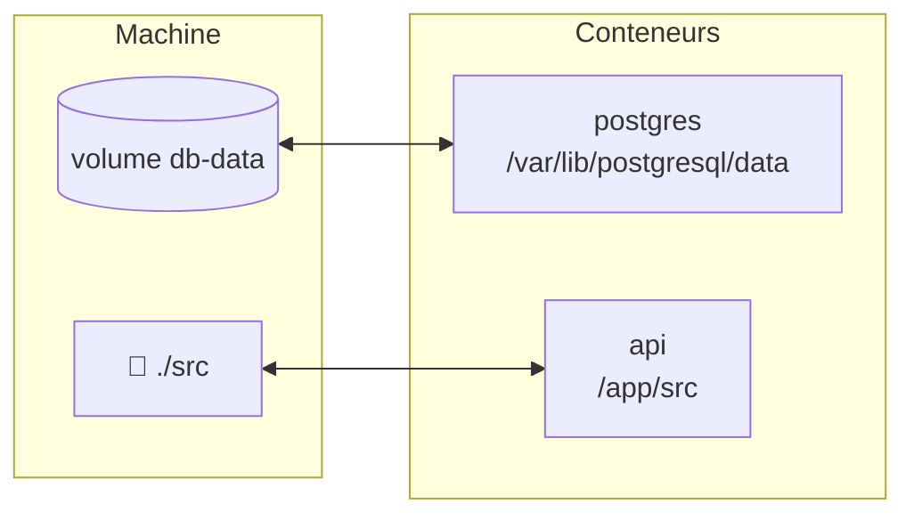

# Volumes Docker

> [!abstract] En bref
> Un conteneur est **jetable** : quand on le supprime, tout ce qu'il contient disparaît. Un **volume** est un espace de stockage **en dehors** du conteneur, qui survit à sa suppression. Indispensable pour les bases de données, et pratique pour partager ton code avec un conteneur en développement.

## Les deux sortes

| Type | Écriture | Pour |
|---|---|---|
| **Volume nommé** (géré par Docker) | `-v db-data:/var/lib/postgresql/data` | les **données** d'une base : durables, performantes |
| **Montage d'un dossier** (*bind mount*) | `-v ./src:/app/src` | le **code** en développement : une modification sur ta machine est vue par le conteneur |



## En pratique

```bash
docker volume ls                     # lister
docker volume inspect db-data        # où il est stocké
docker volume rm db-data             # supprimer ⚠️ données perdues
docker volume prune                  # supprimer les volumes inutilisés ⚠️
```

Dans Compose :

```yaml
services:
  db:
    image: postgres:17
    volumes:
      - db-data:/var/lib/postgresql/data
volumes:
  db-data:
```

## Sauvegarder les données d'un volume

Pour une base, passe par l'outil de la base plutôt que par le volume :

```bash
docker compose exec db pg_dump -U cinetrack -Fc cinetrack > sauvegarde.dump
```

Voir [[BDD-09-PostgreSQL-Pratique|PostgreSQL en pratique]].

## Pièges

- **Une base sans volume** : `docker rm` ou `docker compose down -v` et tout est perdu.
- **Monter `node_modules` depuis Windows** dans un conteneur Linux : incompatibilités et lenteur. Laisse le conteneur avoir son propre `node_modules`.
- **`docker system prune --volumes`** lancé pour faire de la place : il efface aussi les volumes de tes bases.
