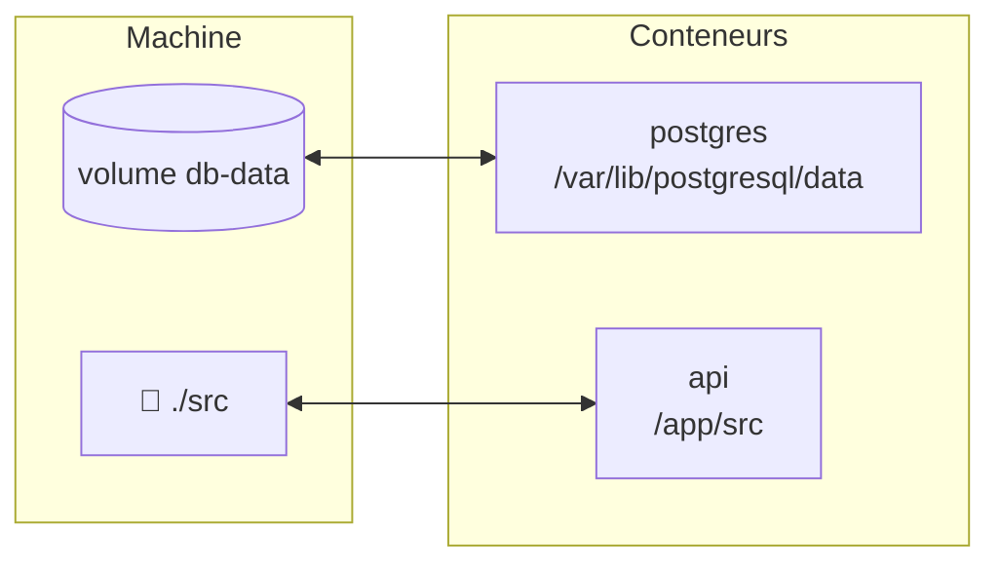

# Volumes Docker

> [!abstract] En bref
> Un conteneur est **jetable** : quand on le supprime, tout ce qu'il contient disparaît. Un **volume** est un espace de stockage **en dehors** du conteneur, qui survit à sa suppression. Indispensable pour les bases de données, et pratique pour partager ton code avec un conteneur en développement.

## Les deux sortes

| Type | Écriture | Pour |
|---|---|---|
| **Volume nommé** (géré par Docker) | `-v db-data:/var/lib/postgresql/data` | les **données** d'une base : durables, performantes |
| **Montage d'un dossier** (*bind mount*) | `-v ./src:/app/src` | le **code** en développement : une modification sur ta machine est vue par le conteneur |


```mermaid
flowchart LR
  subgraph Machine
    V[("volume db-data")]
    S["📁 ./src"]
  end
  subgraph Conteneurs
    P["postgres<br/>/var/lib/postgresql/data"]
    A["api<br/>/app/src"]
  end
  V <--> P
  S <--> A
```

## En pratique

```bash
docker volume ls                     # lister
docker volume inspect db-data        # où il est stocké
docker volume rm db-data             # supprimer ⚠️ données perdues
docker volume prune                  # supprimer les volumes inutilisés ⚠️
```

Dans Compose :

```yaml
services:
  db:
    image: postgres:17
    volumes:
      - db-data:/var/lib/postgresql/data
volumes:
  db-data:
```

## Sauvegarder les données d'un volume

Pour une base, passe par l'outil de la base plutôt que par le volume :

```bash
docker compose exec db pg_dump -U cinetrack -Fc cinetrack > sauvegarde.dump
```

Voir [[BDD-09-PostgreSQL-Pratique|PostgreSQL en pratique]].

## Pourquoi ça marche

Le système de fichiers d'un conteneur est une **couche temporaire** posée sur l'image : elle est créée au démarrage du conteneur et supprimée avec lui.

Un volume est un dossier **géré en dehors** de cette couche, puis **branché** sur un chemin du conteneur. Le conteneur écrit à ce chemin comme d'habitude, mais les fichiers vivent en réalité dans le volume : ils survivent à la suppression du conteneur et peuvent être rebranchés sur un nouveau.

## Contre-exemple

**Intuition fausse : « avec un volume, mes données sont sauvegardées ».**

```bash
docker compose down -v          # ⚠️ supprime aussi le volume
docker volume prune             # ⚠️ supprime les volumes non utilisés
```

Un volume protège les données **de la suppression du conteneur**, pas d'une erreur de commande, d'une panne de disque ou d'une suppression du volume. Une vraie sauvegarde passe par `pg_dump`.

## Pièges

- **Une base sans volume** : `docker rm` ou `docker compose down -v` et tout est perdu.
- **Monter `node_modules` depuis Windows** dans un conteneur Linux : incompatibilités et lenteur. Laisse le conteneur avoir son propre `node_modules`.
- **`docker system prune --volumes`** lancé pour faire de la place : il efface aussi les volumes de tes bases.

## Vérifie sans tes notes

Réponds de tête, à voix haute ou par écrit, **avant** d’ouvrir la réponse.

**1. Quelle différence entre un volume nommé et un montage de dossier (bind mount) ?**

> [!check]- Réponse
> Le volume nommé est géré par Docker, pour les données durables d'une base ; le bind mount relie un dossier de ta machine, pour le code en développement.

**2. Où PostgreSQL range-t-il ses données dans le conteneur ?**

> [!check]- Réponse
> Dans `/var/lib/postgresql/data` : c'est là qu'on branche le volume.

**3. Quelle commande peut effacer les volumes sans qu'on s'en rende compte ?**

> [!check]- Réponse
> `docker compose down -v`, `docker volume prune` ou `docker system prune --volumes`.

## Exercices

> [!info] Comment t’entraîner
> 1. Cherche seul, sans regarder la note.
> 2. Bloqué ? Ouvre l’**indice 1**, puis l’**indice 2**.
> 3. Seulement ensuite, la **solution**.
> 4. Referme tout et **refais l’exercice sans regarder**.

### Exercice 1 · Ajouter un volume à Redis

Redis enregistre ses données dans `/data`. Modifie ce service pour qu'elles survivent à la suppression du conteneur, avec un volume nommé `cache-data`.

```yaml
services:
  redis:
    image: redis:7
```

> [!tip]- Indice 1
> Il faut deux choses : déclarer le volume dans le service, et le déclarer en bas du fichier.

> [!tip]- Indice 2
> La syntaxe est `nom-du-volume:/chemin/dans/le/conteneur`.

> [!success]- Solution
> ```yaml
> services:
>   redis:
>     image: redis:7
>     volumes:
>       - cache-data:/data
>
> volumes:
>   cache-data:
> ```

### Exercice 2 · Volume nommé ou bind mount ?

Pour chaque besoin, choisis un volume nommé ou un bind mount :
1. les données de PostgreSQL en développement ;
2. voir tes modifications de code dans un conteneur sans reconstruire l'image ;
3. les fichiers uploadés par les utilisateurs sur ton serveur ;
4. un fichier de configuration `nginx.conf` que tu modifies à la main.

> [!tip]- Indice 1
> Données durables gérées par Docker, ou fichier de ta machine que tu modifies ?

> [!tip]- Indice 2
> Si tu dois modifier le fichier toi-même depuis ta machine, c'est un bind mount.

> [!success]- Solution
> 1. **Volume nommé** : données durables.
> 2. **Bind mount** : le code de ta machine est vu en direct.
> 3. **Volume nommé** : données durables de l'application.
> 4. **Bind mount** : tu édites le fichier sur ta machine.

### Transfert · Les favoris qui disparaissent

Un problème différent : il vérifie que tu as compris le principe, pas seulement l’exemple.

Un collègue se plaint : « chaque fois que je fais `docker compose down` puis `up`, mes données de test sont toujours là… mais après `docker compose down -v` hier, tout a disparu, et depuis, un nouveau volume vide est créé à chaque fois ». Il veut repartir de ses données de la semaine dernière. Que lui expliques-tu, et que doit-il mettre en place pour la suite ?

> [!tip]- Indice 1
> `-v` supprime les volumes. Les données étaient-elles ailleurs que dans le volume ?

> [!tip]- Indice 2
> Pour la suite : une vraie sauvegarde, en dehors du volume, avec l'outil de la base.

> [!success]- Solution
> - `down -v` a **supprimé le volume** : sans sauvegarde, les données de la semaine dernière sont perdues. Compose recrée un volume vide au `up`, c'est normal.
> - Pour la suite : faire des sauvegardes régulières hors du volume :
>
> ```bash
> docker compose exec db pg_dump -U cinetrack -Fc cinetrack > sauvegarde.dump
> ```
>
> - Et ne plus utiliser `down -v` par réflexe : `down` suffit.

## Je maîtrise quand…

Coche quand tu sais le faire **sans aide**. Une notion n’est maîtrisée que si les 6 cases sont cochées (voir [[Methode-du-coach|Méthode du coach]]).

- [ ] **Expliquer** : Expliquer pourquoi un conteneur perd ses données et comment un volume l'évite
- [ ] **Rappeler** : Dire de mémoire la différence entre volume nommé et bind mount
- [ ] **Utiliser** : Ajouter un volume à un service Compose sans modèle
- [ ] **Résoudre un problème nouveau** : Prévoir quelles commandes effacent les données
- [ ] **Repérer les erreurs** : Repérer une base sans volume ou un `node_modules` monté depuis Windows
- [ ] **Savoir quand ne pas l’utiliser** : Savoir qu'un volume n'est pas une sauvegarde
