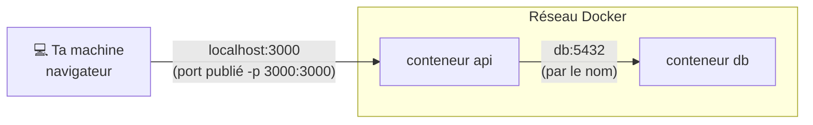

# Réseaux Docker

> [!abstract] En bref
> Les conteneurs sont isolés, mais doivent se parler : l'API a besoin de PostgreSQL. Docker crée des **réseaux virtuels** dans lesquels les conteneurs se trouvent **par leur nom**. Et pour qu'un conteneur soit accessible depuis ta machine, il faut **publier un port**.

## Les deux directions



| Qui parle à qui | Comment |
|---|---|
| ta machine → un conteneur | **publier** le port : `-p 3000:3000` (hôte:conteneur) |
| conteneur → conteneur (même réseau) | par le **nom du service** : `db:5432` |
| conteneur → ta machine | `host.docker.internal` (Docker Desktop) |

## Avec Compose : automatique

Tous les services d'un `docker-compose.yml` sont dans le même réseau. L'API se connecte donc avec :

```bash
DATABASE_URL=postgresql://cinetrack:motdepasse@db:5432/cinetrack
```

et **pas** `localhost`.

## Publier ou non un port

| Service | Publier ? |
|---|---|
| l'API (en dev) | oui, pour l'appeler depuis le navigateur |
| PostgreSQL en **développement** | oui, pour y accéder avec IntelliJ ou Prisma Studio |
| PostgreSQL en **production** | **non** : seule l'API doit y accéder, par le réseau interne |

`-p 127.0.0.1:5432:5432` publie seulement pour ta machine, pas pour le réseau local.

## Déboguer

```bash
docker network ls
docker network inspect cinetrack_default     # quels conteneurs, quelles IP
docker compose exec api ping db              # l'API voit-elle la base ?
```

## Pièges

- **`localhost` dans un conteneur** : c'est **lui-même**. Le symptôme : `ECONNREFUSED 127.0.0.1:5432`.
- **Une application qui écoute sur `127.0.0.1`** dans le conteneur : injoignable, même avec `-p`. Elle doit écouter sur `0.0.0.0` (NestJS : `app.listen(3000, '0.0.0.0')`).
- **Publier la base de production** sur Internet.
