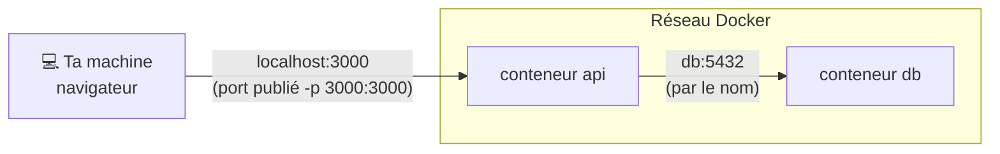

# Réseaux Docker

> [!abstract] En bref
> Les conteneurs sont isolés, mais doivent se parler : l'API a besoin de PostgreSQL. Docker crée des **réseaux virtuels** dans lesquels les conteneurs se trouvent **par leur nom**. Et pour qu'un conteneur soit accessible depuis ta machine, il faut **publier un port**.

## Les deux directions


```mermaid
flowchart LR
  N["💻 Ta machine<br/>navigateur"] -->|"localhost:3000<br/>(port publié -p 3000:3000)"| A["conteneur api"]
  subgraph Réseau Docker
    A -->|"db:5432<br/>(par le nom)"| D["conteneur db"]
  end
```

| Qui parle à qui | Comment |
|---|---|
| ta machine → un conteneur | **publier** le port : `-p 3000:3000` (hôte:conteneur) |
| conteneur → conteneur (même réseau) | par le **nom du service** : `db:5432` |
| conteneur → ta machine | `host.docker.internal` (Docker Desktop) |

## Avec Compose : automatique

Tous les services d'un `docker-compose.yml` sont dans le même réseau. L'API se connecte donc avec :

```bash
DATABASE_URL=postgresql://cinetrack:motdepasse@db:5432/cinetrack
```

et **pas** `localhost`.

## Publier ou non un port

| Service | Publier ? |
|---|---|
| l'API (en dev) | oui, pour l'appeler depuis le navigateur |
| PostgreSQL en **développement** | oui, pour y accéder avec IntelliJ ou Prisma Studio |
| PostgreSQL en **production** | **non** : seule l'API doit y accéder, par le réseau interne |

`-p 127.0.0.1:5432:5432` publie seulement pour ta machine, pas pour le réseau local.

## Déboguer

```bash
docker network ls
docker network inspect cinetrack_default     # quels conteneurs, quelles IP
docker compose exec api ping db              # l'API voit-elle la base ?
```

## Pourquoi ça marche

Chaque conteneur a sa **propre** interface réseau, isolée : pour lui, `localhost` (127.0.0.1) désigne **lui-même**, pas ta machine ni les autres conteneurs.

Docker crée des **réseaux virtuels** avec un petit DNS interne : chaque conteneur y est joignable par son nom. Pour atteindre un conteneur depuis l'extérieur, Docker redirige un port de la machine vers le port du conteneur : c'est la **publication** (`-p`).

Une application doit écouter sur `0.0.0.0` (« toutes les interfaces ») pour recevoir ce trafic redirigé : si elle n'écoute que sur `127.0.0.1`, elle n'accepte que les connexions venant de l'intérieur du conteneur.

## Contre-exemple

**Intuition fausse : « si j'ai mis `-p 3000:3000`, mon API est forcément accessible ».**

```ts
await app.listen(3000, '127.0.0.1');
```

Le port est publié, mais l'API n'écoute que sur l'interface interne du conteneur : la connexion venant de ta machine est refusée. Il faut `app.listen(3000, '0.0.0.0')`.

## Pièges

- **`localhost` dans un conteneur** : c'est **lui-même**. Le symptôme : `ECONNREFUSED 127.0.0.1:5432`.
- **Une application qui écoute sur `127.0.0.1`** dans le conteneur : injoignable, même avec `-p`. Elle doit écouter sur `0.0.0.0` (NestJS : `app.listen(3000, '0.0.0.0')`).
- **Publier la base de production** sur Internet.

## Vérifie sans tes notes

Réponds de tête, à voix haute ou par écrit, **avant** d’ouvrir la réponse.

**1. Comment un conteneur joint-il un autre conteneur du même réseau ?**

> [!check]- Réponse
> Par son nom (le nom du service dans Compose), par exemple `db:5432`.

**2. Que signifie `-p 127.0.0.1:5432:5432` ?**

> [!check]- Réponse
> Le port 5432 du conteneur est publié seulement sur ta machine, pas sur le réseau local.

**3. Faut-il publier le port de PostgreSQL en production ?**

> [!check]- Réponse
> Non : seule l'API doit y accéder, par le réseau interne.

## Exercices

> [!info] Comment t’entraîner
> 1. Cherche seul, sans regarder la note.
> 2. Bloqué ? Ouvre l’**indice 1**, puis l’**indice 2**.
> 3. Seulement ensuite, la **solution**.
> 4. Referme tout et **refais l’exercice sans regarder**.

### Exercice 1 · L'adresse à utiliser

Pour chaque cas, donne l'adresse à utiliser :
1. ton navigateur appelle l'API lancée avec `-p 3000:3000` ;
2. l'API (dans Compose) appelle PostgreSQL (service `db`) ;
3. l'API (dans un conteneur) appelle un service lancé directement sur ta machine, sur le port 4000 (Docker Desktop) ;
4. IntelliJ (sur ta machine) se connecte à la base lancée avec `-p 5432:5432`.

> [!tip]- Indice 1
> Distingue : depuis ta machine vers un conteneur, d'un conteneur vers un autre, d'un conteneur vers ta machine.

> [!tip]- Indice 2
> Depuis ta machine : `localhost` + port publié. Entre conteneurs : le nom du service. Vers la machine : un nom spécial de Docker Desktop.

> [!success]- Solution
> 1. `http://localhost:3000`
> 2. `db:5432`
> 3. `host.docker.internal:4000`
> 4. `localhost:5432`

### Exercice 2 · Sécuriser les ports

Ce `docker-compose.yml` sert en **production** sur un serveur. Qu'est-ce qui pose problème, et comment le corriger ?

```yaml
services:
  api:
    ports: ["3000:3000"]
  db:
    image: postgres:17
    ports: ["5432:5432"]
```

> [!tip]- Indice 1
> Qui a besoin d'accéder à la base en production ?

> [!tip]- Indice 2
> L'API joint la base par le réseau interne de Compose : la publication n'est pas nécessaire.

> [!success]- Solution
> Le port de la base est **publié sur Internet** : n'importe qui peut tenter de s'y connecter.
>
> ```yaml
> services:
>   api:
>     ports: ["3000:3000"]
>   db:
>     image: postgres:17
>     # pas de ports : seule l'API y accède, via db:5432
> ```

### Transfert · Le front qui n'atteint pas l'API

Un problème différent : il vérifie que tu as compris le principe, pas seulement l’exemple.

Ton front Angular tourne **dans ton navigateur**. Ton API tourne dans Compose (service `api`, port publié `3000:3000`). Dans `environment.ts`, l'URL de l'API est `http://api:3000`. Le navigateur affiche `ERR_NAME_NOT_RESOLVED`. Pourquoi ? Corrige.

> [!tip]- Indice 1
> Où s'exécute le code Angular : dans un conteneur, ou dans ton navigateur, sur ta machine ?

> [!tip]- Indice 2
> Le nom `api` n'existe que dans le réseau de Compose. Depuis ta machine, on passe par le port publié.

> [!success]- Solution
> Le code Angular s'exécute **dans ton navigateur**, en dehors du réseau Docker : le nom `api` n'y existe pas.
>
> ```ts
> apiUrl: 'http://localhost:3000'
> ```
>
> Le nom du service ne fonctionne qu'**entre conteneurs** ; depuis ta machine, on utilise `localhost` et le port publié.

## Je maîtrise quand…

Coche quand tu sais le faire **sans aide**. Une notion n’est maîtrisée que si les 6 cases sont cochées (voir [[Methode-du-coach|Méthode du coach]]).

- [ ] **Expliquer** : Expliquer pourquoi `localhost` dans un conteneur désigne le conteneur lui-même
- [ ] **Rappeler** : Dire de mémoire comment joindre un conteneur depuis la machine, depuis un autre conteneur, et la machine depuis un conteneur
- [ ] **Utiliser** : Configurer les adresses d'une API et de sa base dans Compose sans modèle
- [ ] **Résoudre un problème nouveau** : Prévoir si une connexion va passer ou être refusée
- [ ] **Repérer les erreurs** : Diagnostiquer un `ECONNREFUSED`, un `ERR_NAME_NOT_RESOLVED` ou une application qui écoute sur 127.0.0.1
- [ ] **Savoir quand ne pas l’utiliser** : Savoir quand ne pas publier un port : base de données en production
