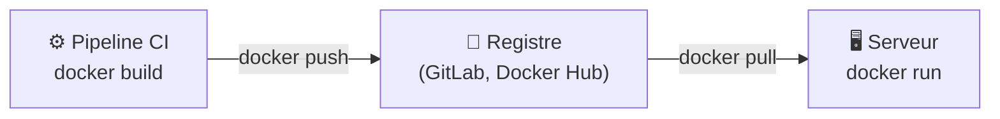

# Registry et Docker Hub

> [!abstract] En bref
> Un **registre** est une bibliothèque d'images Docker. Tu y **télécharges** les images officielles (`postgres`, `node`), et tu y **publies** les tiennes pour qu'un serveur puisse les récupérer. **Docker Hub** est le registre public principal ; **GitLab** a son propre registre, intégré au projet.

## Le circuit d'une image



## Le nom d'une image

```text
registry.gitlab.com/ton-nom/cinetrack-api:1.4.0
└──────── registre ─────┘└── projet ───┘└version┘
```

| Partie | Exemple |
|---|---|
| registre | `registry.gitlab.com` (par défaut : Docker Hub) |
| nom | `ton-nom/cinetrack-api` |
| **étiquette (tag)** | `1.4.0`, `a1b2c3d` (id de commit), `latest` |

## Les commandes

```bash
docker pull postgres:17                                     # télécharger
docker login registry.gitlab.com                            # se connecter
docker build -t registry.gitlab.com/ton-nom/cinetrack-api:1.4.0 .
docker push registry.gitlab.com/ton-nom/cinetrack-api:1.4.0 # publier
docker tag cinetrack-api:local registry.gitlab.com/ton-nom/cinetrack-api:1.4.0   # renommer
```

Dans la CI GitLab, c'est automatique : voir [[05-GitLab-Avance|GitLab avancé]].

## Bien étiqueter

| Étiquette | Pour |
|---|---|
| `1.4.0` (SemVer) | une version publiée |
| l'id court du commit (`a1b2c3d`) | savoir exactement quel code est dans l'image |
| `latest` | pratique en local, **à éviter en production** (on ne sait pas quelle version tourne) |

Déployer une étiquette précise permet de **revenir en arrière** facilement : redéployer `1.3.2`.

## Choisir les images de base

- Préfère les images **officielles** (`node`, `postgres`, `nginx`) ou d'éditeurs vérifiés.
- Précise la **version** (`node:22-alpine`).
- Les registres scannent les images pour trouver des failles connues : regarde les résultats.

## Pièges

- **Publier une image contenant un secret** sur un registre public.
- **Tout déployer avec `latest`** : impossible de savoir ce qui tourne, et de revenir en arrière.
- **Des images non officielles** au nom proche d'une image connue : elles peuvent être malveillantes.
