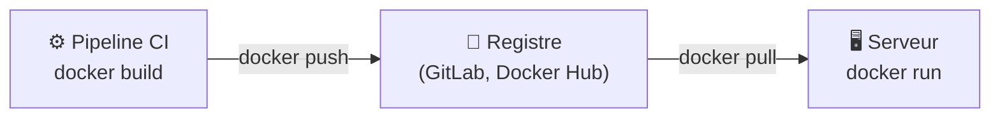

# Registry et Docker Hub

> [!abstract] En bref
> Un **registre** est une bibliothèque d'images Docker. Tu y **télécharges** les images officielles (`postgres`, `node`), et tu y **publies** les tiennes pour qu'un serveur puisse les récupérer. **Docker Hub** est le registre public principal ; **GitLab** a son propre registre, intégré au projet.

## Le circuit d'une image


```mermaid
flowchart LR
  CI["⚙️ Pipeline CI<br/>docker build"] -->|"docker push"| R["🏪 Registre<br/>(GitLab, Docker Hub)"]
  R -->|"docker pull"| S["🖥️ Serveur<br/>docker run"]
```

## Le nom d'une image

```text
registry.gitlab.com/ton-nom/cinetrack-api:1.4.0
└──────── registre ─────┘└── projet ───┘└version┘
```

| Partie | Exemple |
|---|---|
| registre | `registry.gitlab.com` (par défaut : Docker Hub) |
| nom | `ton-nom/cinetrack-api` |
| **étiquette (tag)** | `1.4.0`, `a1b2c3d` (id de commit), `latest` |

## Les commandes

```bash
docker pull postgres:17                                     # télécharger
docker login registry.gitlab.com                            # se connecter
docker build -t registry.gitlab.com/ton-nom/cinetrack-api:1.4.0 .
docker push registry.gitlab.com/ton-nom/cinetrack-api:1.4.0 # publier
docker tag cinetrack-api:local registry.gitlab.com/ton-nom/cinetrack-api:1.4.0   # renommer
```

Dans la CI GitLab, c'est automatique : voir [[05-GitLab-Avance|GitLab avancé]].

## Bien étiqueter

| Étiquette | Pour |
|---|---|
| `1.4.0` (SemVer) | une version publiée |
| l'id court du commit (`a1b2c3d`) | savoir exactement quel code est dans l'image |
| `latest` | pratique en local, **à éviter en production** (on ne sait pas quelle version tourne) |

Déployer une étiquette précise permet de **revenir en arrière** facilement : redéployer `1.3.2`.

## Choisir les images de base

- Préfère les images **officielles** (`node`, `postgres`, `nginx`) ou d'éditeurs vérifiés.
- Précise la **version** (`node:22-alpine`).
- Les registres scannent les images pour trouver des failles connues : regarde les résultats.

## Pourquoi ça marche

Une image construite reste sur la machine qui l'a construite. Pour qu'un **serveur** la lance, il faut un endroit partagé où la déposer et la récupérer : le registre.

Le **nom complet** d'une image contient l'adresse du registre : c'est grâce à lui que `docker push` et `docker pull` savent où aller.

Une **étiquette précise** (version ou id de commit) désigne toujours le même contenu. `latest` est seulement un nom qu'on déplace à chaque publication : il ne dit pas quelle version tourne.

## Contre-exemple

**Intuition fausse : « `latest` désigne toujours la dernière version ».**

```bash
docker pull mon-api:latest   # sur le serveur A, lundi
docker pull mon-api:latest   # sur le serveur B, mercredi
```

Les deux serveurs peuvent faire tourner **deux versions différentes**. Et `latest` n'est mis à jour que si quelqu'un publie avec ce nom : ce n'est pas forcément la plus récente.

## Pièges

- **Publier une image contenant un secret** sur un registre public.
- **Tout déployer avec `latest`** : impossible de savoir ce qui tourne, et de revenir en arrière.
- **Des images non officielles** au nom proche d'une image connue : elles peuvent être malveillantes.

## Vérifie sans tes notes

Réponds de tête, à voix haute ou par écrit, **avant** d’ouvrir la réponse.

**1. À quoi sert un registre ?**

> [!check]- Réponse
> À stocker les images, pour les télécharger (`pull`) et publier les siennes (`push`).

**2. Que contient le nom `registry.gitlab.com/ton-nom/cinetrack-api:1.4.0` ?**

> [!check]- Réponse
> Le registre (`registry.gitlab.com`), le nom de l'image (`ton-nom/cinetrack-api`) et l'étiquette (`1.4.0`).

**3. Pourquoi éviter `latest` en production ?**

> [!check]- Réponse
> On ne sait pas quelle version tourne, et on ne peut pas revenir facilement à une version précise.

## Exercices

> [!info] Comment t’entraîner
> 1. Cherche seul, sans regarder la note.
> 2. Bloqué ? Ouvre l’**indice 1**, puis l’**indice 2**.
> 3. Seulement ensuite, la **solution**.
> 4. Referme tout et **refais l’exercice sans regarder**.

### Exercice 1 · Publier une image

Écris les commandes pour : te connecter au registre GitLab, construire l'image de l'API avec l'étiquette `1.0.0` sous le nom `registry.gitlab.com/awa/cinetrack-api`, puis la publier.

> [!tip]- Indice 1
> Trois commandes : `login`, `build -t`, `push`.

> [!tip]- Indice 2
> Le nom complet (registre + nom + étiquette) doit être identique dans `build -t` et dans `push`.

> [!success]- Solution
> ```bash
> docker login registry.gitlab.com
> docker build -t registry.gitlab.com/awa/cinetrack-api:1.0.0 .
> docker push registry.gitlab.com/awa/cinetrack-api:1.0.0
> ```

### Exercice 2 · Choisir l'étiquette

Quelle étiquette choisis-tu dans chaque cas ?
1. La CI construit une image à chaque commit sur `main`.
2. Tu publies la version 2.1.0 de l'application.
3. Tu testes vite une image sur ta machine.

> [!tip]- Indice 1
> Il y a trois sortes d'étiquettes dans la note : version SemVer, id de commit, `latest`.

> [!tip]- Indice 2
> Laquelle permet de savoir exactement quel code est dans l'image ?

> [!success]- Solution
> 1. L'**id court du commit** (`a1b2c3d`) : on sait exactement quel code est dedans.
> 2. **`2.1.0`** (souvent avec aussi l'id du commit).
> 3. `latest` ou une étiquette locale : acceptable sur ta machine seulement.

### Transfert · Revenir en arrière

Un problème différent : il vérifie que tu as compris le principe, pas seulement l’exemple.

La version `1.5.0` de l'API vient d'être déployée en production et provoque des erreurs. La version précédente était `1.4.2`. Le serveur lance l'API avec `docker run … registry.gitlab.com/awa/cinetrack-api:latest`. Peux-tu revenir facilement à la 1.4.2 ? Que changer pour la suite ?

> [!tip]- Indice 1
> Avec `latest`, le serveur sait-il quelle version il doit relancer ?

> [!tip]- Indice 2
> Si chaque version a son étiquette dans le registre, revenir en arrière = relancer l'ancienne étiquette.

> [!success]- Solution
> - Avec `latest`, rien ne désigne la 1.4.2 : il faut retrouver son étiquette précise dans le registre (si elle a été publiée), ce qui fait perdre du temps.
> - Pour revenir : relancer la version précise :
>
> ```bash
> docker run -d … registry.gitlab.com/awa/cinetrack-api:1.4.2
> ```
>
> - Pour la suite : **toujours déployer une étiquette précise** (`1.5.0` ou l'id du commit), jamais `latest`.

## Je maîtrise quand…

Coche quand tu sais le faire **sans aide**. Une notion n’est maîtrisée que si les 6 cases sont cochées (voir [[Methode-du-coach|Méthode du coach]]).

- [ ] **Expliquer** : Expliquer le circuit d'une image : construire, publier, télécharger, lancer
- [ ] **Rappeler** : Dire de mémoire les parties du nom d'une image et le rôle de l'étiquette
- [ ] **Utiliser** : Publier une image sur un registre sans modèle
- [ ] **Résoudre un problème nouveau** : Choisir une étiquette adaptée à chaque situation
- [ ] **Repérer les erreurs** : Repérer un déploiement fragile basé sur `latest` ou une image non officielle
- [ ] **Savoir quand ne pas l’utiliser** : Savoir quand ne pas publier sur un registre public : image contenant du code privé ou un secret
