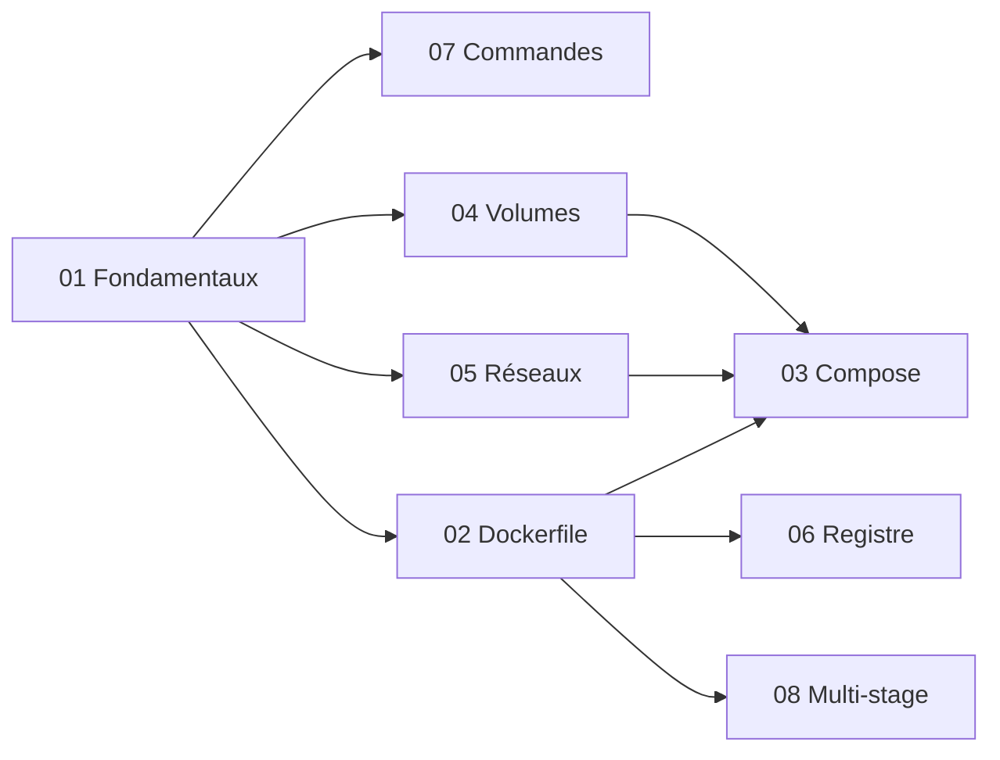

# 🗂️ Docker

> [!abstract] Pourquoi ce domaine
> Conteneuriser les applications pour qu'elles tournent partout de la même façon.

> [!tip] Quand l'étudier
> M11 (utiliser `docker run postgres` dès le M07).

← [[Accueil]] · [[Roadmap-12-mois|Roadmap 12 mois]]

---

> [!tip] Le but
> Pas « j'ai lu les notes », mais : **« donne-moi un problème nouveau et laisse-moi le résoudre »**. Méthode : [[Methode-du-coach|Méthode du coach]].

## Carte du domaine

### 1. Connaissances fondamentales
- Image, conteneur, registre, Dockerfile → [[DK-01-Fondamentaux|Fondamentaux]]
- Lancer, voir, arrêter un conteneur → [[DK-07-Commandes-CLI|Commandes]]

### 2. Concepts indispensables
- Écrire la recette d'une image, et le cache des couches → [[DK-02-Dockerfile|Dockerfile]]
- Lancer plusieurs services ensemble → [[DK-03-Docker-Compose|Docker Compose]]
- Garder les données → [[DK-04-Volumes|Volumes]]
- Faire communiquer les conteneurs, publier un port → [[DK-05-Reseaux|Réseaux]]

### 3. Concepts intermédiaires
- Publier et récupérer des images, les étiqueter → [[DK-06-Registry-Docker-Hub|Registre]]

### 4. Concepts avancés
- Des images finales légères → [[DK-08-Multi-stage-Builds|Multi-stage builds]]

### 5. Compétences pratiques
- lancer PostgreSQL ou Redis sans rien installer ;
- écrire un `docker-compose.yml` pour le développement (base, cache, API) ;
- écrire le Dockerfile d'une API et d'un front ;
- comprendre pourquoi un conteneur ne démarre pas (`ps -a`, `logs`, `exec`, `inspect`).

### 6. Erreurs et confusions fréquentes

| Confusion | La bonne idée | Note |
|---|---|---|
| image / conteneur | le modèle figé / l'image qui tourne | [[DK-01-Fondamentaux\|Fondamentaux]] |
| `RUN` / `CMD` | pendant la construction / au démarrage | [[DK-02-Dockerfile\|Dockerfile]] |
| `EXPOSE` ouvre le port | il documente seulement ; c'est `-p` qui publie | [[DK-02-Dockerfile\|Dockerfile]] |
| `localhost` dans un conteneur = ma machine | = le conteneur lui-même | [[DK-05-Reseaux\|Réseaux]] |
| `depends_on` = service prêt | = démarré ; prêt avec un healthcheck | [[DK-03-Docker-Compose\|Compose]] |
| volume = sauvegarde | il survit au conteneur, pas à une suppression | [[DK-04-Volumes\|Volumes]] |
| `latest` = dernière version | un simple nom qui bouge | [[DK-06-Registry-Docker-Hub\|Registre]] |

### 7. Prérequis
- Le terminal → [[OUT-01-Terminal-Bash|Terminal]], [[LNX-01-Linux-Essentiels|Linux essentiels]]
- IP et ports → [[NET-02-Adresses-IP-Ports|Adresses IP et ports]]
- Node et npm (pour les Dockerfiles d'application) → [[NODE-01-Node-npm|Node et npm]]

### 8. Ce que tu peux ignorer au début
- les réseaux Docker personnalisés (Compose s'en occupe) ;
- Docker Swarm et Kubernetes ;
- l'écriture d'images de base (`FROM scratch`) ;
- les options avancées de `docker build` (BuildKit, cache distant).

## Les dépendances



## Ordre de lecture

1. [[DK-01-Fondamentaux|Docker Fondamentaux]] — Fondamental · M11
2. [[DK-02-Dockerfile|Dockerfile]] — Fondamental · M11
3. [[DK-03-Docker-Compose|Docker Compose]] — Fondamental · M11
4. [[DK-04-Volumes|Volumes Docker]] — Fondamental · M11
5. [[DK-05-Reseaux|Réseaux Docker]] — Intermédiaire · M11
6. [[DK-06-Registry-Docker-Hub|Registry et Docker Hub]] — Intermédiaire · M11
7. [[DK-07-Commandes-CLI|Commandes Docker CLI]] — Intermédiaire · M11
8. [[DK-08-Multi-stage-Builds|Multi-stage Builds]] — Intermédiaire · M11

## Comment travailler une note

1. **Lire** « En bref », puis te poser les [[Methode-du-coach#Les 7 questions|7 questions]].
2. **Lire** les exemples, « Pourquoi ça marche » et le contre-exemple.
3. **Fermer la note** et répondre à « Vérifie sans tes notes ».
4. **Faire les exercices** : seul, puis indice 1, indice 2, solution. Refaire ensuite sans regarder.
5. **Faire le transfert**.
6. **Pratiquer pour de vrai** (sur ta machine, dans un projet).
7. **Cocher** « Je maîtrise quand… » quand les 6 cases sont vraies.
8. **Revenir** à J+1, J+3, J+7, J+21 : rappel et transfert de mémoire.

---

## Progression

```dataview
TABLE WITHOUT ID file.link AS "Note", level AS "Niveau", month AS "Mois", status AS "Statut"
FROM "12-Infrastructure/Docker"
WHERE type = "knowledge"
SORT file.name ASC
```
