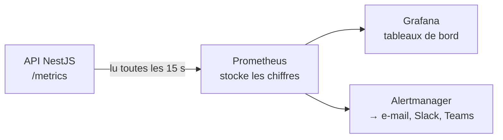

# Métriques et Alerting

> [!abstract] En bref
> Les **métriques** sont des **chiffres mesurés en continu** : nombre de requêtes, temps de réponse, taux d'erreur, mémoire utilisée. Affichées dans des tableaux de bord, elles montrent la **santé** de l'application. Les **alertes** te préviennent quand un chiffre dépasse un seuil, **avant** que les utilisateurs ne se plaignent.

## Logs, métriques, traces

| | Répond à | Exemple |
|---|---|---|
| [[MON-01-Logs\|Logs]] | **que s'est-il passé** ? | « erreur Prisma sur la critique 812 » |
| **Métriques** | **combien / à quelle vitesse** ? | « 2 % d'erreurs, 350 ms en moyenne » |
| [[MON-03-Tracing-Sentry-OpenTelemetry\|Traces]] | **où** le temps est-il passé ? | « 300 ms sur 350 dans la requête SQL » |

## Les 4 chiffres d'or (*golden signals*)

| Signal | Question | Exemple d'alerte |
|---|---|---|
| **Latence** | combien de temps pour répondre ? | 95 % des requêtes > 1 s pendant 5 min |
| **Trafic** | combien de requêtes ? | chute brutale (l'app est peut-être inaccessible) |
| **Erreurs** | quelle part échoue ? | plus de 2 % de réponses 5xx |
| **Saturation** | les ressources sont-elles pleines ? | mémoire > 90 %, disque > 85 % |

**Pourquoi le « 95 % » (p95) et pas la moyenne ?** La moyenne cache les utilisateurs mal servis : 90 requêtes à 100 ms et 10 à 5 s donnent une moyenne de 590 ms qui n'a rien de rassurant ni d'alarmant. Le p95 dit : « 95 % des utilisateurs ont attendu moins de… ».

## Les outils

| Outil | Rôle |
|---|---|
| **Prometheus** | collecte et stocke les métriques |
| **Grafana** | tableaux de bord |
| Alertmanager | envoie les alertes |
| Datadog, New Relic, Grafana Cloud | tout-en-un (payant, ou gratuit avec limites) |
| **UptimeRobot**, Better Stack | vérifier de l'extérieur que le site répond (gratuit) |

Pour tes projets : un **moniteur de disponibilité** gratuit sur `/health` et le tableau de bord de l'hébergeur suffisent.

## De bonnes alertes

- **Sur les symptômes** vus par l'utilisateur (erreurs, lenteur), pas sur chaque détail technique.
- **Actionnables** : chaque alerte dit quoi vérifier.
- **Peu nombreuses** : trop d'alertes = on finit par les ignorer.

## Pièges

- **Tout surveiller, rien regarder** : 40 graphiques que personne n'ouvre.
- **Alerter sur la moyenne** : les problèmes d'une partie des utilisateurs passent inaperçus.
- **Découvrir la panne par un utilisateur** : un simple moniteur de disponibilité l'aurait signalée.
