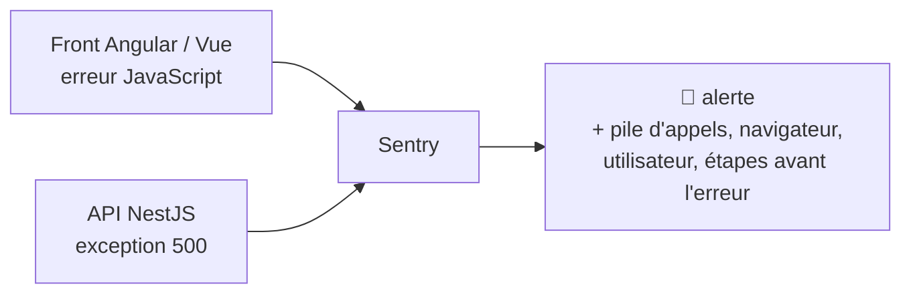

# Tracing Sentry et OpenTelemetry

> [!abstract] En bref
> **Sentry** attrape automatiquement les **erreurs** du front et du back, avec tout le contexte (quel utilisateur, quelle page, quelle ligne de code) : tu sais qu'un bug existe **avant** qu'on te le signale. Le **tracing** (avec **OpenTelemetry**) suit une requête à travers tout le système pour voir **où** le temps est perdu.

## Sentry : le suivi des erreurs



Ce que tu obtiens pour chaque erreur :
- la **pile d'appels** avec les lignes de **ton** code TypeScript (grâce aux source maps) ;
- le **navigateur**, la **page**, l'**utilisateur** concerné ;
- les **actions** juste avant (clics, navigation, requêtes) ;
- le **nombre** d'occurrences et d'utilisateurs touchés, regroupés automatiquement.

### Installation

```ts
// Angular : main.ts
Sentry.init({
  dsn: environment.sentryDsn,
  environment: 'production',
  tracesSampleRate: 0.1,          // 10 % des requêtes tracées
});
```

```ts
// NestJS : instrument.ts, importé en tout premier dans main.ts
Sentry.init({ dsn: process.env.SENTRY_DSN, tracesSampleRate: 0.1 });
```

Offre gratuite suffisante pour des projets perso. Pense à envoyer les **source maps** au build pour voir ton vrai code.

## Le tracing : suivre une requête

Une requête `GET /movies/27205` qui prend 900 ms. Où passe le temps ?

```text
GET /movies/27205 ─────────────────────────────── 900 ms
  ├─ guard JWT                  ▏ 3 ms
  ├─ cache Redis (manqué)       ▏ 2 ms
  ├─ appel TMDB                 ███████████████ 780 ms   ← le coupable
  └─ requête Prisma             ██ 90 ms
```

Chaque morceau s'appelle un *span*. Avec plusieurs services, la trace suit la requête de l'un à l'autre.

**OpenTelemetry** est le **standard** pour produire ces traces (et métriques et logs), indépendamment de l'outil qui les affiche (Jaeger, Grafana Tempo, Datadog, Sentry).

## Quoi mettre en place, et quand

| Étape | Pour tes projets |
|---|---|
| **Sentry** sur le front et l'API | dès la mise en ligne de CinéTrack (M11) |
| moniteur de disponibilité | dès la mise en ligne |
| traces OpenTelemetry | quand il y a plusieurs services ou des lenteurs à comprendre |

## Pièges

- **Envoyer des données personnelles** à Sentry (formulaires, jetons) : configure le filtrage.
- **Tracer 100 % des requêtes** en production : coûteux, 5 à 10 % suffisent.
- **Des erreurs Sentry que personne ne traite** : fais un tri régulier, comme pour les tickets.
