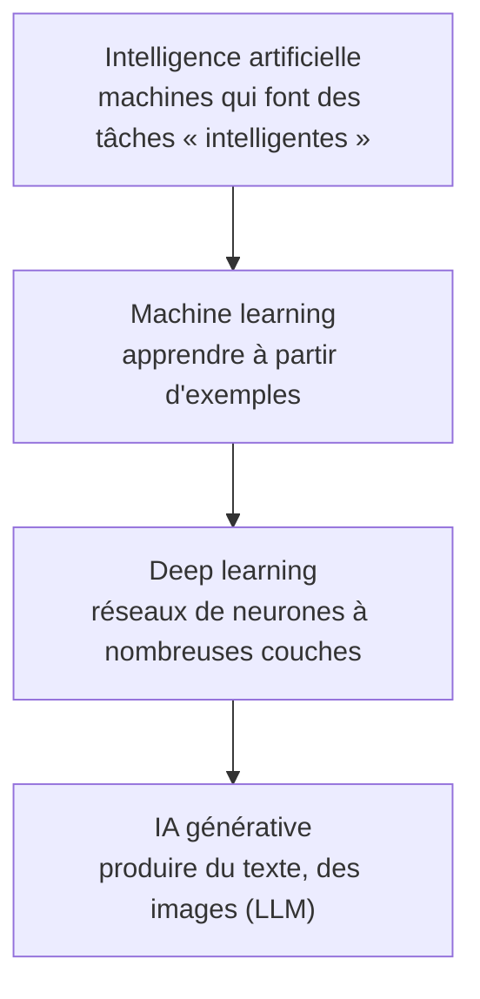

# Fondamentaux IA et Machine Learning

> [!abstract] En bref
> En programmation classique, **tu écris les règles**. En **machine learning**, tu montres des milliers d'exemples et la machine **déduit les règles elle-même**. Les LLM (Claude, GPT…) sont l'aboutissement de cette idée. En tant que développeur, tu **utilises** surtout des modèles déjà entraînés via une API : pas besoin d'être data scientist, mais il faut comprendre ce qu'ils savent faire et où ils se trompent.

## Les poupées russes

## Règles écrites vs règles apprises

| | Programmation classique | Machine learning |
|---|---|---|
| Entrée | données + **règles** écrites par toi | données + **réponses** attendues |
| Sortie | réponses | **règles** (le modèle) |
| Exemple | `if (note >= 4) positif` | 10 000 critiques étiquetées → le modèle devine le ton d'une nouvelle critique |
| Quand | règles claires et peu nombreuses | règles floues ou innombrables (langage, images) |

## Les 3 façons d'apprendre

| Type | Principe | Exemple |
|---|---|---|
| **Supervisé** | exemples avec la bonne réponse | critique → « positive / négative » |
| **Non supervisé** | trouver des groupes tout seul | regrouper les utilisateurs aux goûts proches |
| **Par renforcement** | essais, récompenses, punitions | jeux, et affinage des LLM avec des retours humains |

## Le vocabulaire utile

- **Modèle** : le « programme » obtenu après l'apprentissage.
- **Entraînement** : la phase où le modèle apprend (long, cher, fait par les fournisseurs).
- **Inférence** : utiliser le modèle pour répondre (ce que **tu** fais quand tu appelles une API).
- **Surapprentissage** : le modèle apprend par cœur les exemples au lieu de comprendre ; il échoue sur des cas nouveaux. D'où l'évaluation sur des données **jamais vues**.

## Ce qui a changé avec les LLM

Avant : classer des critiques demandait de collecter des données, entraîner, évaluer, déployer un modèle.
Aujourd'hui : un appel d'API avec une consigne claire suffit souvent (« classe cette critique : positive, négative ou neutre »).

## Pièges

- **Croire que le modèle « comprend »** : il reproduit des régularités statistiques, il peut se tromper avec aplomb.
- **Oublier les biais** : un modèle reproduit ceux de ses données d'entraînement.
- **Utiliser l'IA là où un `if` suffit** : plus lent, plus cher, moins prévisible.

La suite : [[IA-02-LLM-Fondamentaux|Fondamentaux des LLM]].
