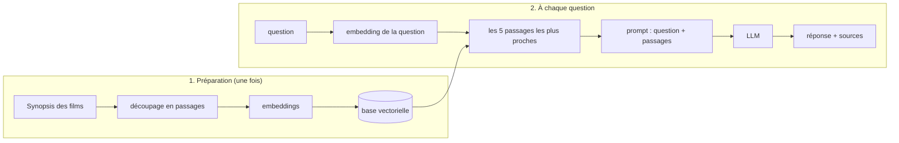

# RAG et Embeddings

> [!abstract] En bref
> Un LLM ne connaît pas **tes** données (ton catalogue de films, ta documentation). Le **RAG** (*Retrieval-Augmented Generation*) règle ça comme un **examen à livre ouvert** : on **cherche** d'abord les passages utiles, puis on les **donne** au modèle avec la question. Pour chercher par le **sens** (et pas seulement par mots-clés), on utilise des **embeddings**.

## Les embeddings : le sens en nombres

Un **embedding** transforme un texte en une liste de nombres (un **vecteur**). Deux textes au sens proche donnent des vecteurs proches.

```text
« astronaute abandonné sur Mars »   → [0.12, -0.83, 0.44, …]
« seul survivant sur une planète »  → [0.10, -0.80, 0.47, …]   ← proche
« comédie romantique à Paris »      → [-0.65, 0.21, -0.09, …]  ← loin
```

Résultat : la recherche « films sur la solitude dans l'espace » trouve *Seul sur Mars*, même si le mot « solitude » n'apparaît pas dans le synopsis.

## Le RAG en 2 temps



## Avec PostgreSQL (pgvector)

Pas besoin d'une nouvelle base : l'extension **pgvector** ajoute les vecteurs à PostgreSQL.

```sql
CREATE EXTENSION vector;

CREATE TABLE passages (
  id        serial PRIMARY KEY,
  movie_id  int,
  content   text,
  embedding vector(1024)          -- la taille dépend du modèle d'embedding
);

-- les 5 passages les plus proches de la question ($1 = son embedding)
SELECT movie_id, content FROM passages ORDER BY embedding <=> $1 LIMIT 5;
```

`<=>` = distance cosinus : plus elle est petite, plus les sens sont proches.

Autres bases vectorielles : Qdrant, Pinecone, Weaviate.

## Le prompt final

```text
Réponds à la question en t'appuyant UNIQUEMENT sur les fiches ci-dessous.
Cite les films utilisés. Si la réponse n'y est pas, dis-le.

<fiches>
  <fiche id="286217">Seul sur Mars : un astronaute se retrouve seul sur Mars…</fiche>
  <fiche id="49047">Gravity : deux astronautes dérivent dans l'espace…</fiche>
</fiches>

<question>Quels films parlent de solitude dans l'espace ?</question>
```

## Ce qui fait un bon RAG

- **Le découpage** : des passages ni trop longs (bruit) ni trop courts (sans contexte).
- **La recherche** : souvent on combine mots-clés et sens (*recherche hybride*).
- **Les sources** : la réponse cite ses passages, l'utilisateur peut vérifier.
- **Les droits** : l'utilisateur ne doit récupérer que les documents **qu'il a le droit de voir**.

## Pièges

- **Indexer des documents confidentiels** accessibles à tous via le chatbot.
- **Juger seulement la réponse finale** : si la recherche ramène les mauvais passages, le meilleur LLM ne peut rien faire.
- **Oublier** que les documents récupérés peuvent contenir des injections de prompt.
