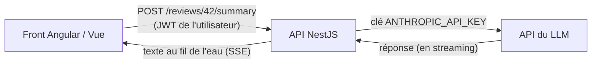

# APIs de LLM

> [!abstract] En bref
> Pour ajouter de l'IA à ton application, ton **back-end** appelle l'API d'un fournisseur (Anthropic, OpenAI, Mistral…) avec une **clé secrète**. Le front ne parle **jamais** directement au LLM : il passe par ton API, qui contrôle ce qui est envoyé, limite les coûts et vérifie la réponse.

## Qui parle à qui



La clé reste dans le `.env` du serveur. Une clé dans `environment.ts` ou une variable `VITE_…` est **publique** : n'importe qui peut la lire et faire exploser ta facture.

## Un appel simple (NestJS + SDK officiel Anthropic)

```bash
npm install @anthropic-ai/sdk
```

```ts
import Anthropic from '@anthropic-ai/sdk';

@Injectable()
export class SummaryService {
  private readonly client = new Anthropic();   // lit ANTHROPIC_API_KEY dans l'environnement

  async summarize(review: string): Promise<string> {
    const message = await this.client.messages.create({
      model: 'claude-opus-5',        // le nom du modèle évolue : vérifie la doc
      max_tokens: 1024,              // longueur maximale de la réponse
      system: 'Tu résumes des critiques de films en une phrase neutre, en français.',
      messages: [{ role: 'user', content: `<critique>${review}</critique>` }],
    });

    if (message.stop_reason === 'refusal') {
      throw new UnprocessableEntityException('Contenu refusé');
    }
    return message.content
      .filter((block) => block.type === 'text')
      .map((block) => block.text)
      .join('');
  }
}
```

À retenir :
- `system` = les consignes, `messages` = la conversation (rôles `user` / `assistant`).
- La réponse est une **liste de blocs** : on garde les blocs de texte.
- **`stop_reason`** dit pourquoi le modèle s'est arrêté : `end_turn` (fini), `max_tokens` (coupé, réponse incomplète), `refusal` (refus).

## Le streaming vers le front

Une réponse longue prend plusieurs secondes. Avec le **streaming**, l'utilisateur voit le texte s'écrire au fur et à mesure.

```ts
@Sse('reviews/:id/summary')
summary(@Param('id', ParseIntPipe) id: number): Observable<MessageEvent> {
  return new Observable((subscriber) => {
    const stream = this.client.messages.stream({
      model: 'claude-opus-5',
      max_tokens: 1024,
      messages: [{ role: 'user', content: '…' }],
    });
    stream.on('text', (text) => subscriber.next({ data: text } as MessageEvent));
    stream.finalMessage().then(() => subscriber.complete(), (err) => subscriber.error(err));
  });
}
```

Côté front : `new EventSource('/api/reviews/42/summary')` et on ajoute chaque morceau reçu au texte affiché.

## Obtenir du JSON fiable

Pour que ton code exploite la réponse (catégorie, note…), demande un **format structuré** plutôt que du texte libre, puis **valide-le** avec un schéma ([[TS-19-Validation-Runtime-Zod|Zod]]). Les API proposent aussi des « sorties structurées » qui imposent un schéma JSON à la réponse.

## Maîtriser les coûts

| Levier | Effet |
|---|---|
| `max_tokens` raisonnable | limite la longueur (et le prix) de chaque réponse |
| limite par utilisateur (rate limiting) | un utilisateur ne peut pas lancer 1 000 résumés |
| cache Redis ([[NEST-13-Cache-Queues-Taches\|Cache et queues]]) | un résumé déjà calculé n'est pas redemandé |
| envoyer le strict nécessaire | moins de tokens en entrée |
| suivre la consommation | le tableau de bord du fournisseur montre tokens et coûts |

## Les erreurs à gérer

| Erreur | Cause | Réaction |
|---|---|---|
| 401 | clé invalide | vérifier la configuration |
| 429 | trop de requêtes | le SDK réessaie déjà ; sinon, ralentir |
| 500 / surcharge | problème côté fournisseur | réessai, puis message clair à l'utilisateur |
| timeout | réponse trop longue | utiliser le streaming |

## Pièges

- **La clé d'API dans le front** : elle sera volée.
- **Pas de limite par utilisateur** : la facture explose.
- **Ignorer `stop_reason`** : une réponse coupée par `max_tokens` est traitée comme complète.
- **Envoyer des données personnelles** sans vérifier ce que l'entreprise autorise (RGPD).
