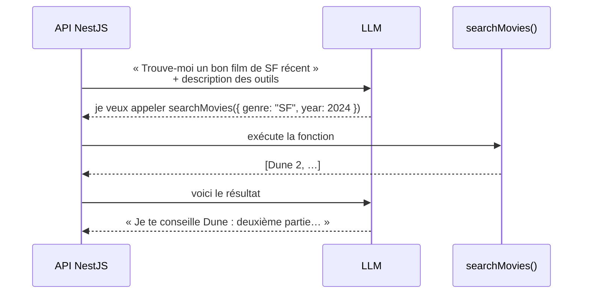

# Agents IA et Tool Use

> [!abstract] En bref
> Seul, un LLM ne peut que **produire du texte**. Avec le **tool use**, tu lui donnes une liste de **fonctions** qu'il peut demander à appeler (chercher un film, lire une fiche…). Ton code exécute la fonction et lui renvoie le résultat. Un **agent**, c'est un LLM qui enchaîne ces appels **en boucle** jusqu'à avoir fini sa tâche.

## Le tool use pas à pas



Le modèle **n'exécute rien lui-même** : il **demande**, ton code **décide** et exécute.

## Décrire un outil

Un outil = un **nom**, une **description** (le modèle la lit pour savoir quand l'utiliser) et un **schéma** des paramètres. Avec le SDK Anthropic et Zod, le *tool runner* gère la boucle pour toi :

```ts
import Anthropic from '@anthropic-ai/sdk';
import { betaZodTool } from '@anthropic-ai/sdk/helpers/beta/zod';
import { z } from 'zod';

const client = new Anthropic();

const searchMovies = betaZodTool({
  name: 'search_movies',
  description: 'Cherche des films dans le catalogue CinéTrack par genre et année.',
  inputSchema: z.object({
    genre: z.string().describe('Genre, par exemple "SF" ou "comédie"'),
    year: z.number().optional(),
  }),
  run: async (input) => JSON.stringify(await moviesService.search(input)),
});

const answer = await client.beta.messages.toolRunner({
  model: 'claude-opus-5',
  max_tokens: 4096,
  tools: [searchMovies],
  messages: [{ role: 'user', content: 'Trouve-moi un bon film de SF récent' }],
});
```

Les paramètres envoyés par le modèle sont **vérifiés par le schéma Zod** avant d'appeler `run`.

## Workflow ou agent ?

| | Workflow | Agent |
|---|---|---|
| Qui décide des étapes | **ton code** | **le modèle** |
| Exemple | résumer → classer → enregistrer | « organise ma soirée cinéma » |
| Fiabilité | élevée, prévisible | variable |
| Coût | maîtrisé | plusieurs appels, difficile à prévoir |

**Règle** : commence par **un seul appel**, puis un **workflow**. Passe à un agent seulement si la tâche l'exige vraiment.

## MCP

**MCP** (*Model Context Protocol*) est un **standard** pour brancher des outils et des données sur les assistants IA. Tu écris un **serveur MCP** une fois (par exemple « accès au catalogue CinéTrack ») et n'importe quel assistant compatible peut l'utiliser.

## La sécurité d'abord

Un agent qui peut appeler des outils peut **faire des dégâts** :
- **séparer lecture et écriture** : `search_movies` librement, `delete_review` jamais sans contrôle ;
- **confirmation humaine** pour toute action irréversible (supprimer, payer, envoyer) ;
- **droits minimaux** : l'outil agit avec les droits de l'utilisateur, pas en administrateur ;
- **tout journaliser** : quels outils, quels paramètres, quel résultat.

## Pièges

- **Des descriptions d'outils vagues** : le modèle ne sait pas quand les utiliser.
- **Des erreurs muettes** : renvoie un message d'erreur clair au modèle (« film introuvable »), il pourra corriger.
- **Un agent là où un appel suffisait** : plus lent, plus cher, moins fiable.
