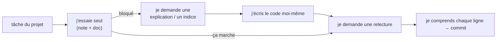

# IA Assistée au Développement

> [!abstract] En bref
> Les assistants de code (Claude Code, GitHub Copilot, Cursor, l'assistant d'IntelliJ) te font gagner énormément de temps. Mais c'est comme un **GPS** : si tu le suis sans jamais regarder la carte, tu ne sais toujours pas où tu es, et le jour où il se trompe, tu fonces dans le lac. **Ton but est d'apprendre** : utilise l'IA comme un **tuteur**, pas comme quelqu'un qui fait les projets à ta place.

## Les 5 règles

1. **Essaie seul d'abord** (15 à 30 min), avec ta note et la doc. Ensuite seulement, demande à l'IA.
2. **Ne commite jamais un code que tu ne sais pas expliquer** ligne par ligne.
3. **Demande des explications**, pas seulement du code : « pourquoi ça marche ? », « quelle autre façon ? ».
4. **Vérifie dans la doc officielle** : l'IA propose souvent une ancienne syntaxe.
5. **Respecte la politique de l'entreprise** : pas de code client ni de données confidentielles dans un outil non autorisé.

## Les bons usages

| Usage | Exemple de demande |
|---|---|
| comprendre une erreur | « explique-moi cette erreur et ses causes possibles, sans me donner la correction » |
| comprendre du code | « explique ce que fait cet intercepteur, ligne par ligne » |
| relire ton code | « relis ce service : bugs, cas oubliés, noms à améliorer ? » |
| te faire tester | « pose-moi 5 questions sur les signals, une à la fois, et corrige-moi » |
| générer du répétitif | tests d'un cas simple, DTO, données de test |
| découvrir | « quelles sont les façons de gérer le cache dans NestJS, avec leurs avantages ? » |

## Ce qui signale une réponse datée

| Tu vois… | Aujourd'hui on écrit… |
|---|---|
| `*ngIf`, `*ngFor` | `@if`, `@for` |
| `NgModule`, `standalone: true` partout | composants standalone par défaut |
| `@Input()` / `@Output()` | `input()` / `output()` |
| Vue `export default { data() {…} }` | `<script setup lang="ts">` |
| `new Vuex.Store` | Pinia |

## La bonne séquence sur un projet

## Pièges

- **Copier-coller sans comprendre** : tu avances vite… et tu n'apprends rien.
- **Accepter une API inventée** : si la méthode n'existe pas dans la doc, elle n'existe pas.
- **Laisser passer une faille** : clé d'API en dur, requête SQL construite à la main, pas de vérification des droits.
