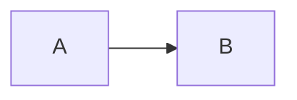

# <% tp.file.title %>

> [!abstract] Introduction
> _Une phrase : ce que fait ce concept et où on l'utilise._

> [!warning]- Prérequis
> [[]]

---

## Théorie

> [!question]- C'est quoi ?
> _Définition + mini-exemple._

> [!example]- Analogie
> _Une image de la vie courante._

> [!question]- Pourquoi l'utiliser ?
> _Quel problème ça résout ?_

> [!question]- Comment ça marche ?
> _Mécanisme, étape par étape._

> [!question]- Quand l'utiliser ?
> _Situations adaptées, alternatives._

> [!danger]- Quand NE PAS l'utiliser / Limites
> _Contre-indications._

### Schéma



---

## Vocabulaire

| Terme | Définition en une ligne |
|-------|--------------------------|
|       |                          |

---

## Points clés

- 

---

## Pièges courants

> [!bug]- Erreurs fréquentes
> - 

---

## Paramètres / Configuration

| Paramètre | Description | Défaut | Notes |
|-----------|-------------|--------|-------|
|           |             |        |       |

---

## Exemple minimal

```typescript
// Plus petit exemple qui fonctionne
```

> [!note] Ce que j'en retiens
> __

---

## Pour aller plus loin (niveau senior)

> [!tip]- Ce qui distingue un dev expérimenté
> - 

---

## Connexions

**Arbre théorique :**
- Sujet parent → [[]]
- Sous-sujets → [[]]
- À comparer avec → [[]]

**Pratique :**
- Extrait de code → [[04_Snippets/]]
- Projet → [[02_Projects/]]

---

## Auto-vérification

> [!check]- Est-ce que je maîtrise vraiment ?
> - 

> [!faq]- Questions d'entretien
> - 

---

## Tâches

- [ ] #task Appliquer le concept dans un exemple
- [ ] #task Écrire le snippet
- [ ] #task Mettre à jour `status` une fois maîtrisé

---

## Notes brutes

- ?
